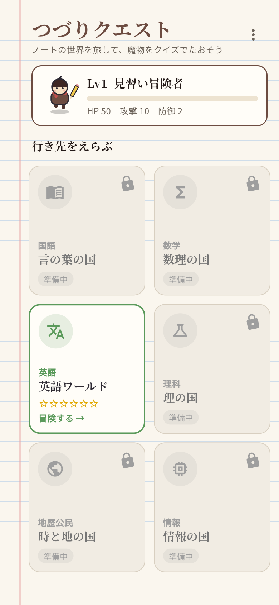
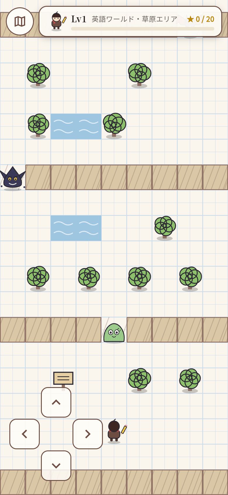
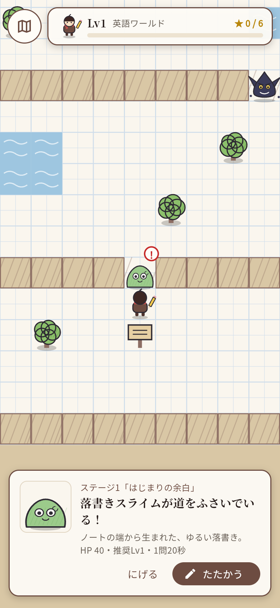
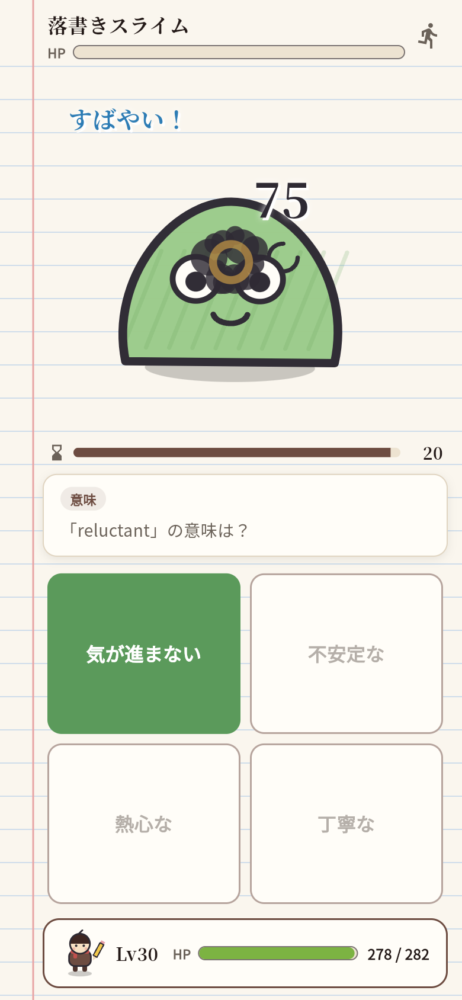
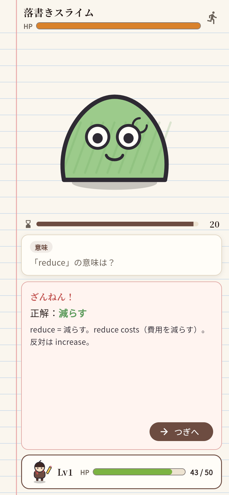
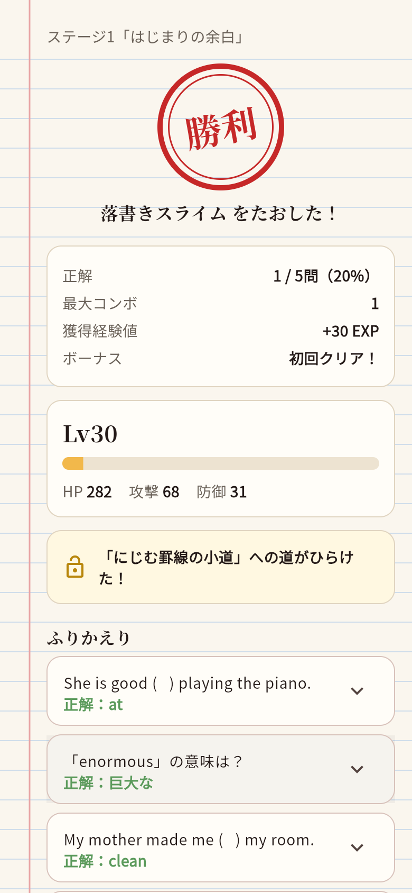

# つづりクエスト（仮）— Flutter 版の試作アプリ

`../rpg_game`（ゲームのロジックと問題データ）を使って、実際に遊べる画面を作った単体アプリです。
あとで school_planner の `lib/features/rpg_game/` に組み込みます。

| ワールドマップ | フィールド | 遭遇 |
| --- | --- | --- |
|  |  |  |

| バトル（正解） | バトル（不正解） | 結果 |
| --- | --- | --- |
|  |  |  |

## 動かし方

school_planner を開発している PC（Flutter が入っている PC）で次を実行します。

```
cd rpg_game_app
flutter pub get
flutter run -d chrome     # ブラウザで動かす（いちばん簡単）
flutter run               # Android の実機やエミュレーターをつないでいる場合
```

操作方法:
- **歩く**: 画面左下の十字ボタン（押している間歩き続ける）。PC では矢印キーか WASD キーでも歩けます
- **話しかける**: 敵や看板に向かって歩くと話しかけられます
- **バトル**: 4択をタップして回答します。制限時間を過ぎると時間切れです
- **最初からやり直す**: ワールドマップ右上の「︙」→「データをリセット」

## 定期テストの海（学習モード）

ワールドマップ上部の「定期テストの海」から入ります。ダメージはなく、1問ずつ正解と解説を確認できます。

| タブ | 内容 |
| --- | --- |
| 高1 | 12単元（文型・時制・助動詞・不定詞・動名詞・分詞・受動態・比較・関係詞・仮定法・接続詞・代名詞など）各8〜9問 |
| 高2 | 12単元（完了・助動詞+完了・分詞構文・関係詞/仮定法/比較の発展・否定・倒置・名詞節・複雑な構文）各6問 |
| 高3 | 9単元（高度な関係詞・仮定法・倒置・省略・強調/挿入/同格・複雑な分詞構文/不定詞/時制・構文）各6問 |
| 単語・熟語 | 単語（基礎・標準・難関）と熟語、各40語。英→日／日→英、1回20問 |
| LEAP 🔒 | パスワードで開く個人用モード。一覧を貼り付けて取り込み、100語ずつの範囲から20問 |

- 単元ごとの最高正答率が記録され、一覧に表示されます
- 結果画面から「間違えた問題だけもう一度」を選べます
- 問題・単語帳はすべて自作です。LEAP の単語データはアプリにも GitHub にも含まれていません。取り込んだ一覧は、その端末の中にだけ保存されます
- 取り込んだ単語帳の問題は、RPG のバトル・宿・課金ワールドでは使えないようにしています
- パスワード（仮）は `lib/study/personal_books.dart` の `leapPassword` です。アプリの中に書かれた合言葉なので、強い保護ではありません

## 20エリアと地方

フィールドは下から草原（エリア1〜5）→ 海岸（6〜10）→ 洞窟（11〜15）→ 溶岩（16〜20、四天王とラスボス）と続きます。地方ごとに床・壁・木・水の見た目が変わり、画面上部に今いる地方が表示されます。

ワールドマップ右上の「︙」→「エリアを選んでバトル（確認用）」から、好きなエリアの敵とすぐに戦えます（結果は保存されません）。

## 宿（RPG）

20のエリアすべてに宿（屋根の赤い家）があり、話しかけると次の敵の文法テーマの授業を受けられます。授業のあとに練習問題が5問あり、正解1問につき 2 EXP もらえます。何度でも受けられます。

## 画面と演出

| 画面 | 内容 |
| --- | --- |
| ワールドマップ | 6教科の国。英語だけ遊べて、ほかは鍵つきの「準備中」。主人公がその場で足ぶみしている |
| フィールド | 方眼ノートの世界を自由に歩ける見下ろし型マップ（Flame を使用）<br>道をふさぐ敵に話しかけるとバトル。倒した敵は★がついて道の脇へどく<br>近くの敵には「！」、最後にはトロフィーがある |
| バトル | 敵の登場（上から落ちてくる）、待機中のゆれ、えんぴつの斬撃、敵が白く光ってゆれる、ダメージ数字<br>「すばやい！」「◯ COMBO!」表示、被弾時の画面ゆれと赤いふち、HP バーの減少、撃破時のインクしぶき<br>不正解のときは解説を表示 |
| 結果 | 「勝利」「敗北」のはんこ、経験値バーが伸びる演出、LEVEL UP 表示、能力の上昇量<br>次のステージの解放、間違えた問題のふりかえり |

絵はすべてコード（`lib/art/`）で「ノートの落書き風」に描いているので、画像素材はありません。
あとでイラストに差し替えるときは、`paintHero` と `paintEnemy` を画像の描画に置き換えるだけで済みます。

## 構成

```
lib/
├─ main.dart
├─ app/        テーマ（つづりの配色）、サービスの受け渡し
├─ art/        主人公・敵・ノートの紙を描くコード
├─ world/      ワールドマップ画面（購入ダイアログはダミー）
├─ field/      フィールド（Flame のゲーム本体・マップ定義・画面）
├─ battle/     バトル画面・結果画面
└─ data/       進行状況の保存（端末内。移植時は Firestore に差し替え）
```

## school_planner に組み込むときの注意

- UI はこの試作では `package:flutter/material.dart` を使っています。school_planner では `material_ui` パッケージと既存の `lib/app/theme.dart` に合わせて書き換えます
- 保存先（`PrefsProgressRepository`）は、Firestore の `users/{uid}/rpg_progress/main` を読み書きする実装に差し替えます
- 準備中ワールドの購入ダイアログは、デバッグ版でだけ「購入する」ボタンが出ます（ダミー購入）
- マップの形は `lib/field/field_map.dart` の文字の並びで決まります。敵の配置と進行順がおかしくないかは、テスト（`test/field_map_test.dart`）で自動チェックしています
